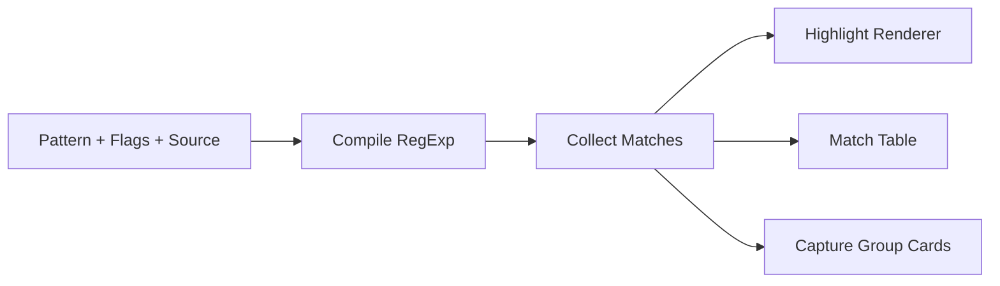

# Regex Playground Pro

Interactive regex debugger focused on readability and safe text handling.

## Features

- Pattern + flag controls (`g i m s u y`).
- Real-time match highlighting.
- Match table with index/length for each hit.
- Capture-group viewer for positional and named groups.
- Error handling for invalid patterns.
- Preset sample for email parsing.

## Technical Design

- `index.html`: accessible control and output panels.
- `styles.css`: responsive two-column editor/output workspace.
- `script.js`:
  - Compiles dynamic `RegExp` instances.
  - Collects matches safely (including zero-length safeguards).
  - Escapes HTML to prevent injection in rendered output.



## Local Run

```bash
python -m http.server 8000
```

Open `http://localhost:8000`.

## GitHub Pages Compatibility

- Static-only architecture.
- No build dependency.
- Works directly on GitHub Pages root.

## Future Improvements

- Tokenized regex parser for expression explanation.
- Performance guardrails for catastrophic backtracking cases.
- Saved pattern snippets via localStorage.